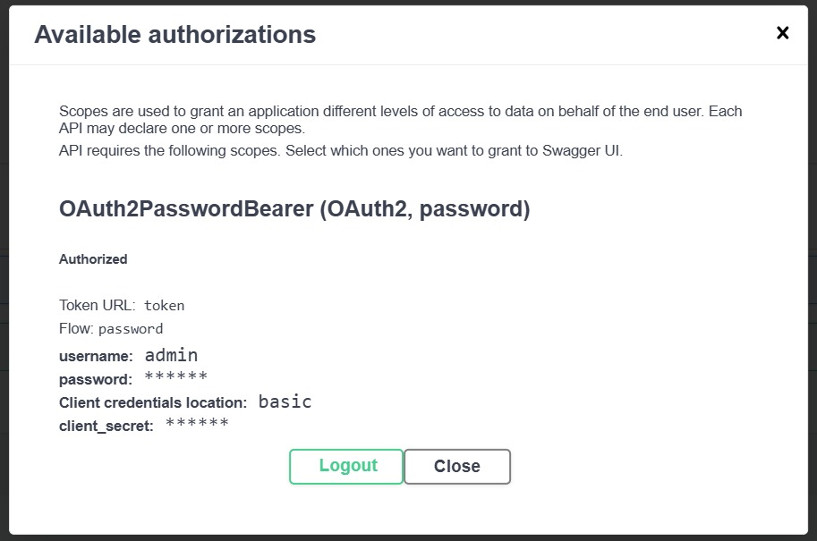

# 🧠 ML Model Serving с аутентификацией

К предыдущему дз добавлено:
✅ Аутентификация через JWT  
✅ Минимальное разграничение прав (RBAC)  
✅ Защита эндпоинтов по ролям (`admin`, `user`)  

---

## 🔧 Используемые технологии

- **FastAPI** — для создания API
- **UperNet + ConvNeXt-tiny** — модель сегментации из HuggingFace
- **JWT / OAuth2PasswordBearer** — аутентификация
- **Poetry** — управление зависимостями
- **Makefile** — автоматизация задач

---

## 📦 Установка и запуск

### 1. Установка зависимостей

```bash
poetry install
```

### 2. Запуск сервера

```bash
make dev
```

Сервис будет доступен по адресу:  
👉 http://localhost:8000  
Swagger UI: http://localhost:8000/docs

---

## 🌐 API Endpoints

| Метод | Путь         | Описание |
|-------|--------------|----------|
| POST  | `/token`     | Получить JWT-токен |
| GET   | `/users/me/` | Получить информацию о текущем пользователе |
| POST  | `/segment`   | Выполнить сегментацию изображения |

---

## 🔐 Аутентификация

### Авторизация

Отправь POST-запрос:

```bash
curl -X POST "http://localhost:8000/token" \
     -H "accept: application/json" \
     -H "Content-Type: application/x-www-form-urlencoded" \
     -d "username=admin" \
     -d "password=password"
```

**Пример ответа:**

```json
{
  "access_token": "eyJhbGciOiJIUzI1NiIsInR5cCI6IkpXVCJ9.xxxxx",
  "token_type": "bearer"
}
```

## 👥 Разграничение прав (RBAC)

В системе реализовано минимальное разделение ролей:

- `admin`: может получать данные о себе и выполнять сегментацию
- `user`: может только выполнять сегментацию

Можно легко расширить до более сложных разграничений.

---

## Пример успешной авторизации через Swagger UI

